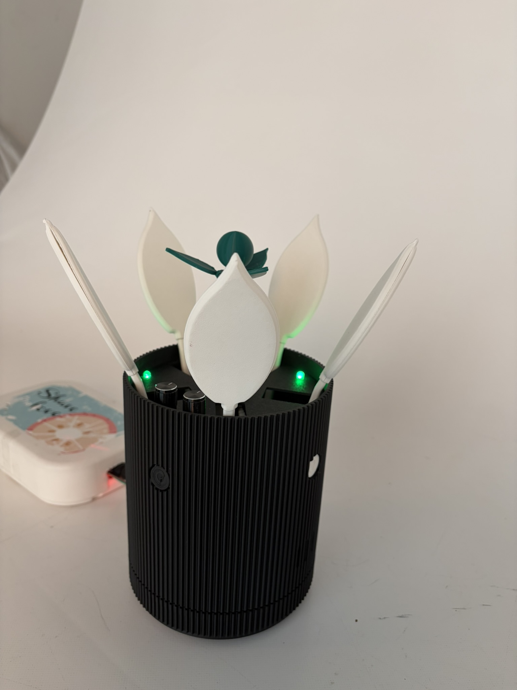
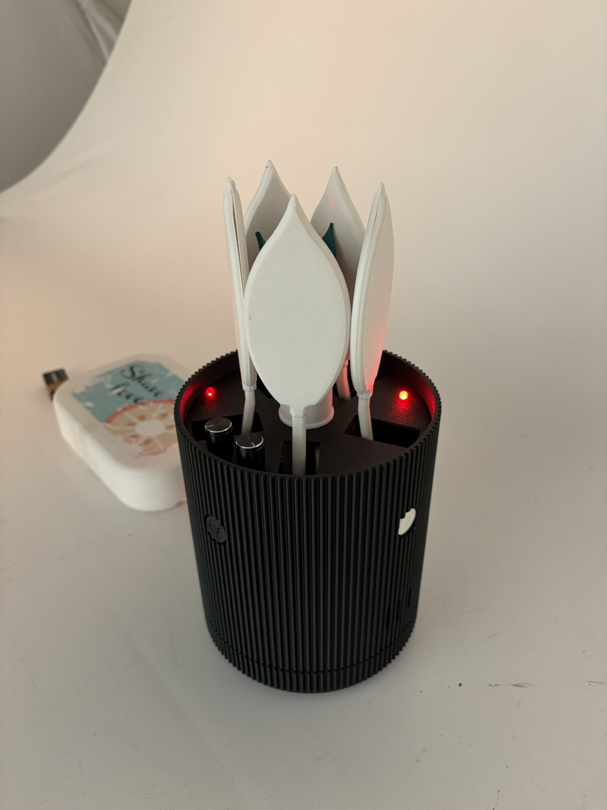
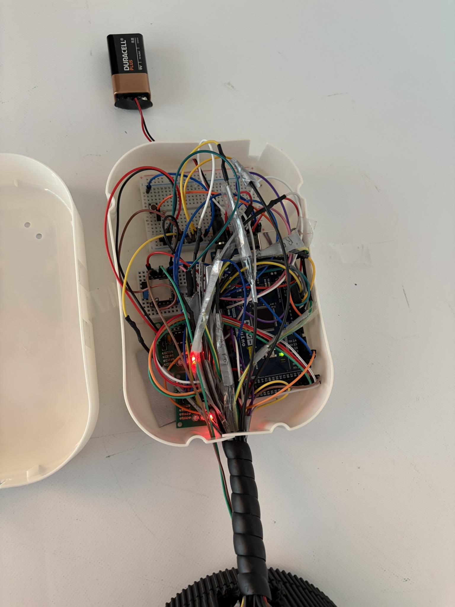
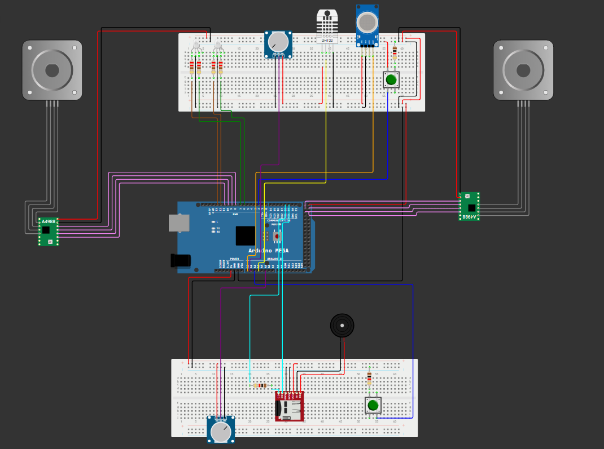

## Onderwerp - Oxybloom
Als onderwerp hebben we gekozen voor Oxybloom, het project voor Gebruiksgericht Ontwerp. Oxybloom is een interactieve bloem die via licht, beweging en geluid de gebruiker informeert over de luchtkwaliteit in huis. Het doel van het project is om mensen op een eenvoudige en intuïtieve manier te helpen correct te verluchten.

De bloem toont de status van de luchtkwaliteit door middel van bewegende bladeren. Wanneer de bladeren gesloten zijn, betekent dit dat de luchtkwaliteit slecht is. Wanneer de bladeren openstaan, is de luchtkwaliteit goed. Om deze beweging mogelijk te maken, wordt gebruikgemaakt van een mechanisch systeem dat aangestuurd wordt door een stappenmotor.

Daarnaast wordt er gewerkt met leds als extra feedbacksysteem: rood duidt op een slechte luchtkwaliteit en groen op een goede luchtkwaliteit. Ook beschikt Oxybloom over voice feedback. Door op een knop te drukken, wordt een DFPlayer geactiveerd die de juiste mp3-boodschap afspeelt afhankelijk van de gemeten situatie.

Als extra beschikt Oxybloom ook over een soort beloningssysteem. Hierbij groeit de steel van de bloem wanneer de luchtkwaliteit gedurende een bepaalde tijd goed blijft. Deze groei verloopt in vijf verschillende fases. Het systeem wordt aangestuurd door een tweede stappenmotor, waardoor de steel stap voor stap kan uitschuiven.

Als sensorinput gebruikt de plant een vochtsensor, samen met een CO₂-sensor. Alle componenten worden aangestuurd door een Arduino Mega 2560.

De plant kan aan/uit gezet worden door een drukknop, ook kunnen het volume van de speaker en de helderheid van de leds worden aangepast door twee verschillende potentiometers.
## Proces
We zijn gestart met verschillende tests zoals:
De helderheid van een led kunnen aanpassen en aan en uit kunnen schakelen.
  

  
  
  

Na een tijdje wisten we hoe de meeste componenten die we nodig hadden functioneerden, met behulp van YouTube-video’s en datasheets.

Toen zijn we begonnen met de hoofdcode dat we stapsgewijs hebben opgebouwd.

1. Als eerste hebben we de motor laten kalibreren door hem naar één kant te laten roteren. Dit hebben we gedaan omdat stappenmotoren hun positie niet kunnen onthouden.([code](https://github.com/runeseghers/OXYBLOOM/blob/main/tests/code_1_motor_draait_en_kalibreert/code_1_motor_draait_en_kalibreert.ino))
2. Dan hebben we de motor laten besturen door een luchtvochtigheidssensor([datasheet sensor](https://www.mouser.com/datasheet/2/758/DHT11-Technical-Data-Sheet-Translated-Version-1143054.pdf?srsltid=AfmBOorO1tDjnJdzTmvuW-I0MY3YAzV3U6862pVDsvfQup3PF48_19x4))(code 2)

3. Doordat de motor nu 2 standen heeft kan een led de status van de motor weergeven dit zie je in [code_3](https://github.com/runeseghers/OXYBLOOM/blob/main/tests/code_3_Led_erbij/code_3_Led_erbij.ino).
4. De motor wordt niet alleen bestuurt aan de hand van de luchtvochtigheid maar ook door de co2 waarde in een ruimte. Dit kan je zien in [code_5](https://github.com/runeseghers/OXYBLOOM/blob/main/tests/code_5_motorwerktopco2envocht/code_5_motorwerktopco2envocht.ino). Ook worden de waarden continu geprint zodat het makkelijker is voor ons om te programmeren. Bij deze code hadden we een foutje opgemerkt namelijk bij het opstarten en wanneer de luchtkwaliteit slecht werd, was de led groen en die moest rood zijn.([code 6](https://github.com/runeseghers/OXYBLOOM/blob/main/tests/code_6_zonder_led_fout/code_6_zonder_led_fout.ino))
5. In [code_7](https://github.com/runeseghers/OXYBLOOM/blob/main/tests/code_7_rood_knipperen/code_7_rood_knipperen.ino) en [code_8](https://github.com/runeseghers/OXYBLOOM/blob/main/tests/code_8_led_regelen_met_potentiometer/code_8_led_regelen_met_potentiometer.ino) hebben we de code aangepast zodat de helderheid van de leds bediend konden worden door een potentiometer([datasheet](https://www.mouser.com/datasheet/2/13/RV24AF-1658492.pdf?srsltid=AfmBOoroW_hk-SwTR9ZNtt5Is-XXlw9FjysBGhcXY1r1qHgsNOvlgD1j)) en de led begint te flikkeren wanneer er een maximale grens wordt overschreden van de co2 sensor.
6. Om geluid uit een speaker te kunnen krijgen hebben we via een YouTube-filmpje ([link](https://www.youtube.com/watch?v=UN9XPWHamHw&t=221s)) een test kunnen doen los van onze huidige code. We hebben dit gedaan met een DFPlayer([datasheet](https://www.mouser.be/datasheet/3/1500/1/DFPlayer_Mini_Manual.pdf)) en een 8 ohm/1W speaker. Het zijn 2 bestanden die worden afgespeeld aan de hand van de stand van de motor.
We hebben hierbij een potentiometer toegevoegd om het volume van de speaker te kunnen regelen.
  

  
  

Nadat dit werkte hebben we de 2 aparte boards samengevoegd.
  

  

  Met deze code en hardware werd de eerste prototypes getest.
  

  

7. Omdat we nog een motor en meerdere rgb leds wilden toevoegen hebben we onze Arduino Uno aan de kant geschoven en zijn we overgestapt naar een Arduino Mega.

  

  

## Eindresultaat.
  

  
  
  

 Dit is de uiteindelijke [code](https://github.com/runeseghers/OXYBLOOM/blob/main/Opkomende%20Technologie%C3%ABn/Code/Code.ino).

## Benodigdheden
### Software
- Arduino.ino
### Microcontroller
- Arduino Mega 2560
### Libraries
- Stepper library
- DHT library
- DFRobotDFPlayerMini library
- Adafruit Unified Sensor library
### Sensoren
- DHT11 (vocht/temperatuursensor)
- MQ-135 (CO2-sensor)
### Componenten
- 2x Stappenmotor 4 fasen 5 V
- 2x ULN2003 (stappenmotor driver)
- 2x RGB Led
- 4x Weerstand 220 Ohm
- 3x Weerstand 1k Ohm
- 2x Drukknop
- 2x Potentiometer
- DFR 0299 (DFplayer)
- Micro SD kaart
- Speaker 8 Ohm
- Kabels
- Batterij 9V
- 9V Batterij clip naar 2.1mm DC plug
- Mini breadbord
- Half breadbord
## Connectieschema

  

