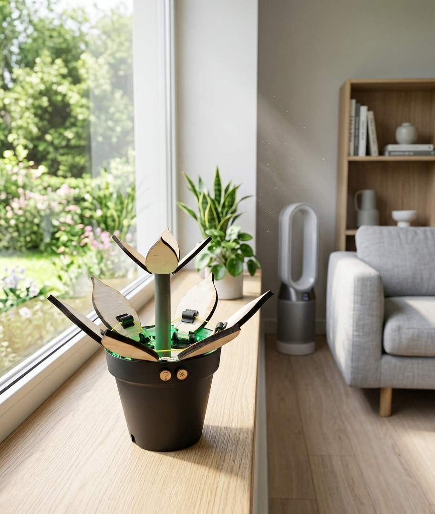

# Oxybloom
Een slimme bloem die huishoudens helpt om de luchtkwaliteit te verbeteren.

🛠️ Built by ``Dré Devaere`` & ``Rune Seghers``   
🔥 Supervised by ``prof. dr. Bas Baccarne``, ``Yannick Christiaens`` & ``Wouter Devriese``    
🌱 Grown at ``Ghent University`` 🏛️ ``Industrial Design Engineering`` ([project overview](https://github.com/basbaccarne/human-centered-design))       

12/04/2026  

## Samenvatting
Veel mensen ventileren hun huis niet op de juiste manier, of doen dit te weinig, vaak uit onwetendheid. Dit kan leiden tot een onnodig energieverbruik, slechtere luchtkwaliteit en vochtproblemen. Om inzicht te krijgen in dit probleem hebben we een enquête afgenomen bij ongeveer 100 respondenten. Daaruit bleek dat 50% van de deelnemers zich niet bewust is van het verband tussen duurzaamheid en correcte ventilatie. Dit wijst duidelijk op een kennis- en gedragskloof: veel mensen weten niet wanneer en hoe ze hun woning optimaal kunnen ventileren.

Onze oplossing is een innovatief product dat gebruikers begeleidt bij het ventileren op de juiste momenten en op de juiste manier. Het product geeft aan wanneer het beste moment is om te ventileren, op basis van het binnen- en buitenklimaat. Door dit hulpmiddel te gebruiken kunnen bewoners efficiënter ventileren, waardoor ze minder energie hoeven te verbruiken om bijvoorbeeld te verwarmen. Daarnaast draagt correcte ventilatie bij aan een gezonder binnenklimaat: vochtproblemen en schimmelvorming worden beperkt, en de lucht in huis blijft frisser.

Op deze manier helpt onze oplossing niet alleen het energieverbruik te verminderen, maar verbetert het ook het wooncomfort en de gezondheid van de bewoners. Door bewust ventilatiegedrag te stimuleren, sluiten we de kennis- en gedragskloof en zorgen we voor een duurzamere en gezondere leefomgeving.

  

## Introductie
Veel mensen ventileren hun huis niet correct of doen dit te weinig, vaak uit onwetendheid. Dit kan leiden tot een slechtere luchtkwaliteit, vochtproblemen en onnodig energieverbruik, vooral in goed geïsoleerde woningen. Uit een enquête([Rapport](https://docs.google.com/document/d/1lkF2mxv8E-GvEGbEEImv3dyBfMGQf3W1utyAzGHfSRQ/edit?tab=t.0)) onder ongeveer 100 respondenten bleek dat 50% van de deelnemers zich niet bewust is van het verband tussen duurzaamheid en correcte ventilatie. Dit laat zien dat er een duidelijke kennis- en gedragskloof bestaat: veel bewoners weten niet wanneer en hoe ze hun woning optimaal kunnen ventileren.

Het doel van dit project is een product te ontwerpen dat bewoners actief ondersteunt bij ventileren. Het apparaat meet continu het binnenklimaat, zoals temperatuur, luchtvochtigheid en CO₂-niveau, en combineert deze gegevens met weersinformatie van buiten. Op basis hiervan geeft het product signalen wanneer de luchtkwaliteit binnen niet goed is en het dus het beste moment is om ramen te openen of ventilatiesystemen in te schakelen. Gebruikers kunnen het systeem bovendien personaliseren: ze kunnen bijvoorbeeld kleuraanpassingen waardoor het product niet alleen functioneel, maar ook visueel aantrekkelijk wordt.

Het product werkt energiebesparend en draagt bij aan een gezonder binnenklimaat. Door efficiënter te ventileren, hoeft minder energie te worden gebruikt om de woning te verwarmen of te koelen. Bovendien helpt het vochtproblemen en schimmelvorming te voorkomen, waardoor de luchtkwaliteit verbetert en de woning comfortabeler en gezonder wordt.

## Inhoudstafel

1. [Methodologie](./docs/methodologie.md)
2. [Discovery](./docs/discovery.md)
3. [Defintion](./docs/definition.md)
4. [Develop 1](./docs/develop_1.md)
5. [Design Requirements](./docs/design_requirements.md)
6. [Bill of materials](./docs/bom.md)

## Kritische reflectie
Tijdens het eerste semester van dit project staan we momenteel redelijk goed en zijn we tevreden over wat we al verricht hebben. We zijn blij met de kwaliteit van de prototypes die we in het eerste deel van het proces hebben ontwikkeld. Deze prototypes tonen aan dat we onze ideeën stap voor stap hebben kunnen omzetten naar concrete en werkbare oplossingen. Het begin van het project was uitdagend, vooral door het aftasten van de juiste aanpak en het maken van keuzes. Gaandeweg hebben we echter geleerd om beter te plannen, te testen en bij te sturen waar nodig. Aan het einde van het eerste semester kunnen we stellen dat het project niet alleen inhoudelijk vooruitgang heeft geboekt, maar ook bijgedragen heeft aan ons leerproces. We hebben waardevolle inzichten opgedaan in prototyping, samenwerking en probleemoplossend denken, wat dit project tot een leerrijke ervaring maakt.

Voor semester twee hebben we met het nieuwe prototype ons het vorige project naar een hoger niveau gebracht: gebruikers konden zich beter voorstellen hoe het product werkt, wat waardevolle inzichten opleverde. Door tijdens de tests écht door te vragen naar het “waarom” achter reacties hebben we veel dieper begrip gekregen van gebruikersbehoeften. Het gebruik van de WOz-methode bleek daarbij bijzonder effectief, omdat we zo konden observeren hoe voice feedback wordt ontvangen en meteen konden bijsturen. We zijn tevreden met deze stap vooruit.

## Noot inzake het gebruik van AI
AI werd gebruikt om inspiratie te verkrijgen over bestaande apparaten, zodat deze konden worden gebenchmarkt. Ook werd het gebruikt om een storyboard te maken na dat de verschillende situaties werden uitgeschreven. Het hero shot is ook deels gemaakt met AI. Verder werd AI ook gebruikt een interface te maken voor een toekomstige app via Figma Make om zo wat tijd te besparen. Ook werd gebruik gemaakt van AI om excel tabellen en tabellen van word documenten om te zetten in code voor de Github.

## Bijlagen
### Discovery
* Literatuuronderzoek (N=11)
  * [Rapport](https://docs.google.com/document/d/1AfcCo7FvvEoZ-1zk95RXVjzMou38a-mL8L6_zgns-Gg/edit?tab=t.0)
* Interviews (N=3)
  * [Protocol](https://docs.google.com/document/d/12qbczfWnEImfsNoVpZ4aLVHFY0JWGxJDZ43AeHY9-mw/edit?tab=t.0#heading=h.bomqbvbcsevu)
  * [Rapport](https://docs.google.com/document/d/1SwhVlLS8_lIYlqKu6CdZsSIWJLKw36k-8GklZlpGox8/edit?usp=sharing)
* Benchmarking (N=10)
  * [Rapport](https://docs.google.com/document/d/12xce8BJE52bgFbQwACKA-BeoK-U8daDStCAenrfK3ME/edit?tab=t.0).
* Enquête (N=104)
  * [Enquête](https://docs.google.com/forms/d/e/1FAIpQLSccWiVOp48grHZ2cQGmuoxTeAmDsEP0Rcj8K9Pg0Ig58J9OUA/viewform)
  * [Rapport](https://docs.google.com/document/d/1lkF2mxv8E-GvEGbEEImv3dyBfMGQf3W1utyAzGHfSRQ/edit?tab=t.0)

### Definition
* User testing wave 1 (N=13)
  * [Protocol](https://docs.google.com/document/d/1rY86oE0Vs1P8iOJ6PyYzX7_pxgFzCAlSUU5zqiSWN3I/edit?tab=t.0)
  * [Rapport](https://docs.google.com/document/d/1wBb8zgVL7p_F-QvWJVQwW2Svkrl49Ys-igBUbI4e8e8/edit?tab=t.0)
* User testing wave 2 (N=5)
  * [Protocol](https://docs.google.com/document/d/1o-T7NU_5Rs0rAPHm1JbzHmHQB5fDIzvxbv1kqwsdvhM/edit?usp=sharing)
  * [Rapport](https://docs.google.com/document/d/1fPvEVBDay3pfUAcs47p9CDcH445wIs4vGXjvJl6ddqQ/edit?tab=t.0#heading=h.91kt9wm5brsg)

### Develop 1
* User testing (N=5)
  *  [Protocol](https://docs.google.com/document/d/14uV6BEjJ6iHEM_Fh3N6zzjam72_YUCfdtqbi0Aa-V18/edit?tab=t.0)
  *  [Rapport](https://docs.google.com/document/d/18PjJ0K22VwaZccacPXWkhhGwo1DeL2UdXLAWv1GZMLM/edit?tab=t.0)

### Develop 2
* [Antropometrische Analyse](https://docs.google.com/document/d/1EPGG9i6jSZKGZ7VrqN3QsUSug69F0fZezZaDpOkvLG0/edit?tab=t.0)
* [Enquête Analyse](https://docs.google.com/document/d/19_CdSDRdH0FaFUVYFXiZnsAKY0Y2GnrCZgDpmhAUXtg/edit?tab=t.0)
* [User test protocool](https://docs.google.com/document/d/15RyFqs8qL6PJrg-n36wd5jC9kE5sktj_Zqppsj13D40/edit?tab=t.0#heading=h.vd45tvf1wpcx)
* [User test analyse](https://docs.google.com/document/d/1LS81rWTh8fn5G55BaOMGvlZr1KS65SzYiV8W_BzbE0Y/edit?tab=t.0)
### Develop 3
* 
## Licentie

This repository contains both software and design materials created as part of an industrial design energineering project at Ghent University.

- **Software and code:** [MIT License](./LICENSE-MIT)  
- **Design, documentation, CAD, and media:** [CC BY 4.0 License](./LICENSE)
  
You are free to reuse and build upon this work, both commercially and non-commercially, as long as proper attribution is given to the original authors.

## Bronnen
### Benchmarking:
Airthings. (2025). *Wave Plus radon & air quality monitor*. Geraadpleegd op 25 oktober 2025, van https://www.airthings.com/wave-plus
 
Awair. (2025). *Awair Glow air quality monitor*. Geraadpleegd op 25 oktober 2025, van https://www.getawair.com/glow
 
Blueair. (2025). *Blue Pure air purifier series*. Geraadpleegd op 25 oktober 2025, van https://www.blueair.com/nl
 
Eve Systems. (2025). *Eve Room indoor air quality monitor*. Geraadpleegd op 25 oktober 2025, van https://www.evehome.com/nl/eve-room
 
Foobot. (2025). *Foobot air quality monitor*. Geraadpleegd op 25 oktober 2025, van https://www.foobot.com
 
IKEA. (2025). *VINDSTYRKA air quality sensor*. Geraadpleegd op 25 oktober 2025, van https://www.ikea.com/nl/en/p/vindstyrka-air-quality-sensor-30515989/
 
Kaiterra. (2025). *Laser Egg air quality monitor*. Geraadpleegd op 25 oktober 2025, van https://www.kaiterra.com/laseregg
 
Netatmo. (2025). *Healthy Home Coach indoor air quality monitor*. Geraadpleegd op 25 oktober 2025, van https://www.netatmo.com/nl-nl/weather/healthcoach
 
Tado°. (2025). *Smart thermostat and room sensors*. Geraadpleegd op 25 oktober 2025, van https://www.tado.com/nl-nl
 
uHoo. (2025). *uHoo smart air monitor*. Geraadpleegd op 25 oktober 2025, van https://uhooair.com/nl/

