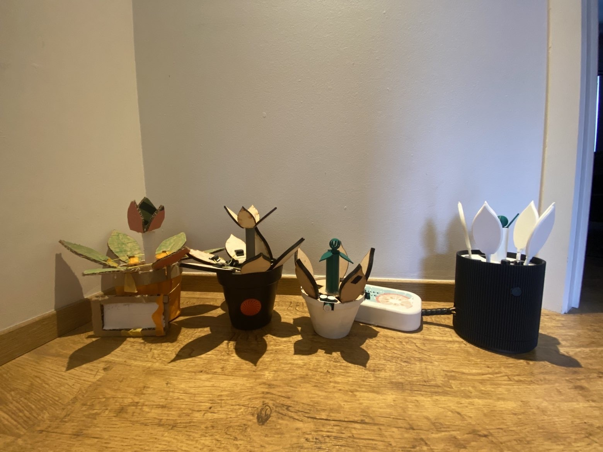

# Conclusie
Op basis van alle voorgaande fases — discovery, definition en de drie develop-fases — is OXYBloom uitgegroeid tot een concept dat erin slaagt een complex en vaak onzichtbaar probleem (een slecht geventileerde, energieverslindende woning) op een laagdrempelige en aantrekkelijke manier zichtbaar en behapbaar te maken voor de gebruiker.

Het finale concept is een slimme, plantvormige luchtkwaliteitsmonitor die via een combinatie van CO₂- en vochtsensoren continu de binnenlucht opvolgt. Wanneer de luchtkwaliteit achteruitgaat, communiceert het product dit op een subtiele, niet-storende manier: via kleurveranderingen, een lichte beweging van de "bladeren" en optionele voice feedback. Een bijhorende app biedt extra diepgang voor wie dat wenst (grafieken, beloningssysteem, personalisatie), maar is nooit een vereiste — het product blijft volledig stand-alone bruikbaar. Hiermee wordt voldaan aan een groot deel van de design requirements die doorheen het traject werden opgesteld (zie Design Requirements).

We zijn ervan overtuigd dat dit de best mogelijke oplossing is voor het geschetste probleem, en dit om verschillende redenen:
Het sluit aan bij een reëel en aangetoond probleem. Uit de discovery-fase bleek dat ongeveer de helft van de respondenten zich niet bewust is van het verband tussen ventilatiegedrag en energieverbruik. Een product dat dit verband op een tastbare manier zichtbaar maakt, speelt direct in op die kennis- en gedragskloof.

De metafoor van de bloem werkt. Waar bestaande oplossingen op de markt vaak technisch, klinisch en weinig "gezellig" aanvoelen (zoals bleek uit de benchmarking), kiest Oxybloom voor een vorm die mensen graag permanent in hun leefruimte plaatsen. Uit de testen in de definition-fase en develop 1 bleek dat de bloem zowel qua esthetiek als qua "bereidheid tot actie" beter scoorde dan alternatieve metaforen (zoals de parkiet) of een digitale interface.

De interactie is doordacht en getest op echte gebruikers. Doorheen develop 1 en 2 werd stap voor stap gebouwd aan een product waarbij voice feedback, knoppositie, knoptype en de algemene ergonomie steeds opnieuw getest en bijgestuurd werden. Dit heeft geleid tot een ontwerp dat zonder uitleg te begrijpen en te bedienen is — een van de centrale usability goals van het project.

De detaillering is afgestemd op wat gebruikers echt waarderen. Develop 3 toonde aan dat gebruikers een balans zoeken tussen technologie en natuur: realistische, plant-achtige details (bladvorm, textuur, bodemplaat met steentjes) gecombineerd met subtiele, geïntegreerde technologie (verlichting, ventilatie). Deze inzichten zijn rechtstreeks verwerkt in de finale CMF-keuzes.

Het concept is praktisch en functioneel uitgewerkt. Het prototype is niet enkel esthetisch, maar ook functioneel: voorzien van werkende elektronica en code, een herbruikbaar en goed te vullen waterreservoir, en een duidelijke materiaalkeuze. De volledige technische uitwerking is terug te vinden in de Bill of Materials.

Kortom: OXYBloom combineert een wetenschappelijk onderbouwd probleem, een emotioneel aansprekende metafoor, een getest en gebruiksvriendelijk interactieontwerp, en een esthetisch afgewerkt eindproduct. Suggesties voor verder onderzoek en mogelijke verbeterpunten (zoals prijsbepaling, een Pro-versie, of uitbreidingen met externe sensoren) worden besproken in de kritische reflectie.
## Toekomstperspectief
Hoewel het huidige prototype een goed onderbouwde en functionele oplossing biedt, zijn er nog verschillende richtingen waarin het concept verder kan groeien. Op basis van de feedback uit de verschillende testfases en het gesprek met studenten in Gent, zien we vooral potentieel in de volgende aspecten:

Uitbreiding met externe sensoren. Een apart, buiten geplaatst apparaat zou bijkomende data (zoals buitenluchtkwaliteit) kunnen verzamelen, wat de adviezen van Oxybloom nog accurater zou maken.

Modulariteit en duurzaamheid. Vervangbare onderdelen en een eventuele CO2-filter zouden de levensduur verlengen en het product op termijn volledig zelfstandig kunnen laten functioneren.

Verdere personalisatie en toegankelijkheid. Functies zoals een trilfunctie in de app (voor gebruikers met een visuele beperking) of een visuele indicatie (balkje) van de luchtkwaliteit kunnen de toegankelijkheid verder vergroten.

Bijkomende functionaliteit. De diffuser zou bijvoorbeeld ook ingezet kunnen worden om geuren te verspreiden, wat de meerwaarde van het product verder kan vergroten.

Businessmodel en prijsbepaling. Prijs blijft een belangrijke drempel. Verder onderzoek naar een haalbaar prijspunt, en de manier waarop eventuele Pro-functies worden aangeboden (zonder gebruikers van de basisversie het gevoel te geven iets te missen), is noodzakelijk voor een succesvolle marktintroductie.

Deze elementen vormen geen onderdeel van het huidige prototype, maar bieden waardevolle aanknopingspunten voor een vervolgtraject of een volgende iteratie van Oxybloom.
## Evolutie Prototypes

  

## Filmpje

In dit [Filmpje](https://www.youtube.com/shorts/xmFyi1Ips3s) wordt het proces die doorlopen is en het gebruik van de OXYBloom uitgelegd.
