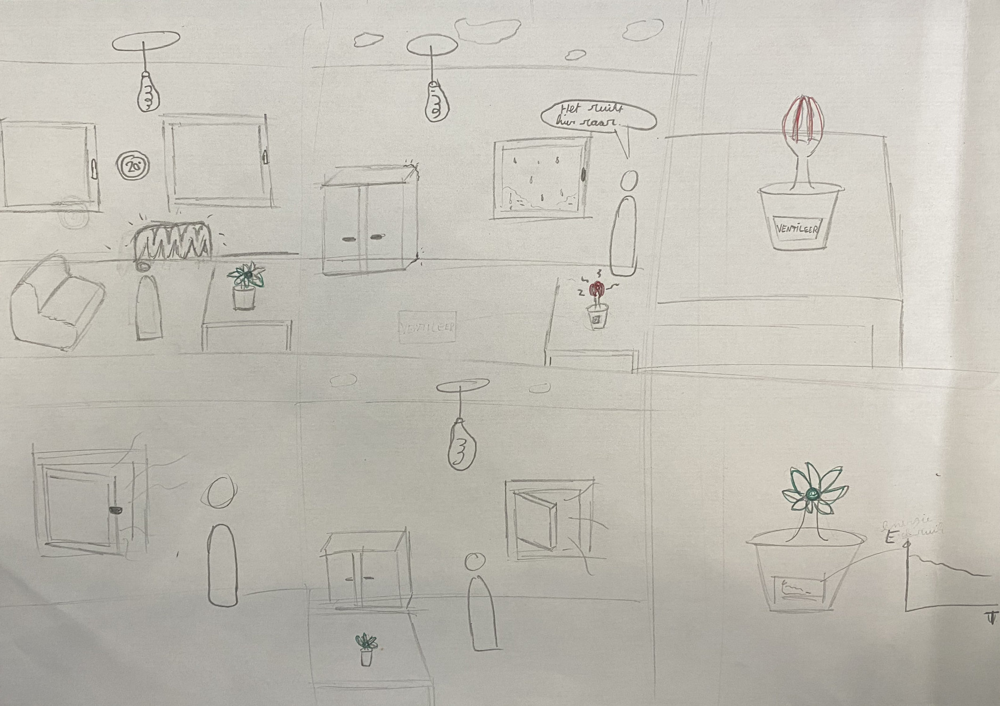
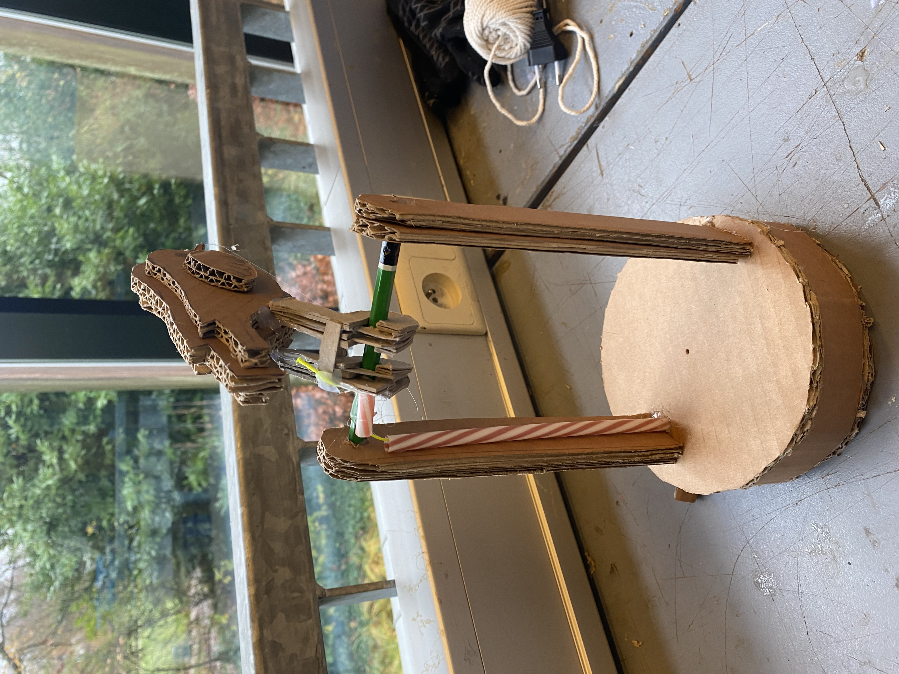
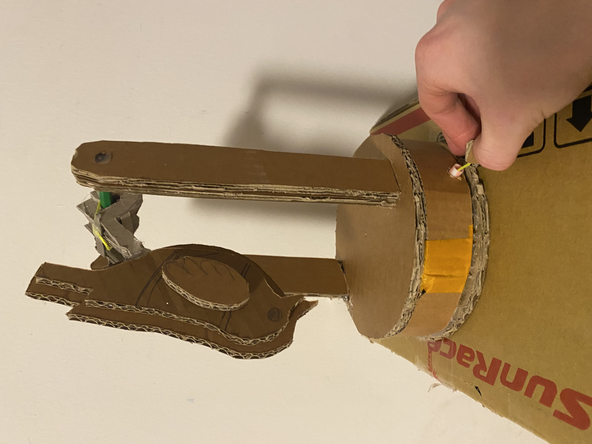
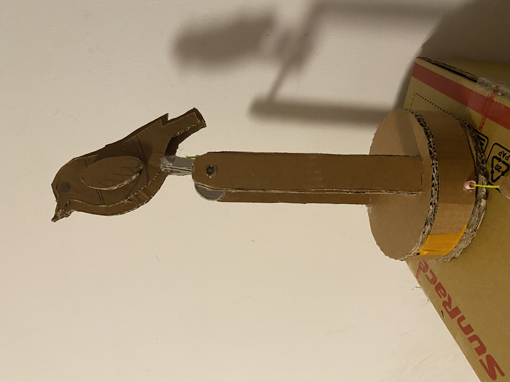

# Wave 1 – Onderzoeksfase
Analyse van kartonnen prototypes

## Doelstellingen
Hoofddoel:
In deze fase wilden we onderzoeken welk fysiek of digitaal concept het meest intuïtieve signaal geeft om gebruikers aan te zetten tot het ventileren van een binnenruimte.

Bij de start van wave 1 werd eerst een storyboard gemaakt.

  

Uit het storyboard werden de onderzoeksvragen opgesteld:

- Welke vorm van visuele feedback wordt het snelst begrepen?
- Welk prototype lokt de grootste bereidheid tot actie uit?
- Welk concept is esthetisch aanvaardbaar om in een woning te plaatsen?
- Verschillen deze meningen tussen verschillende gebruikers?

## Materiaal & Methoden
Prototypes (karton & low-fidelity)

1. Een bloemvormig mechanisch prototype dat opent en sluit als metafoor voor luchtkwaliteit

2. Een parkiet die houding verandert bij slechte lucht

3. Een digitale tabletinterface

## Prototype 1: Bloem

  
  
  

## Prototype 2: Parkiet

  
  
  

## Prototype 3: Tablet

  

## Testmethode

13 respondenten (11 volwassenen, 2 kinderen) evalueerden alle prototypes willekeurig om de beurt. 
Per prototype werden scores (1–7) gegeven voor signaalduidelijkheid en bereidheid tot actie, 
aangevuld met een voorkeur voor gebruik in de woning.

## Resultaten: Duidelijkheid & bereidheid tot actie

| Groep | Bloem (Duidelijkheid / Bereidheid) | Parkiet (Duidelijkheid / Bereidheid) | Tablet (Duidelijkheid / Bereidheid) |
|----------|---------------|----------------------|----------|
| Vrouwen(6) | 6.2 / 6.9 | 5.5 / 4.1 | 4.1 / 4.2 |
| Mannen(5) | 5.5 / 5.5 | 6.2 / 5.9  | 5.1 / 5.2 |
| Kinderen(2) | 2.5 / 4.7 | 5.0 / 7.0 | 3.8 / 3.5 |
| Totaal(13) | 5.4 / 6 | 5.7 / 5.2 | 4.4 / 4.5 |

De bloem scoort het hoogst op bereidheid tot actie (gem. 6/7) en wordt vooral door vrouwen als voorkeursoplossing gekozen. De parkiet wordt door mannen en kinderen als zeer duidelijk en activerend ervaren, maar scoort lager op esthetische acceptatie. De tablet scoort het laagst op zowel duidelijkheid als bereidheid tot actie, voornamelijk door visuele drukte en schermmoeheid, ondanks de waardering voor de datavisualisatie en het beloningssysteem. Dit werd door respondenten samengevat met opmerkingen als “weer een scherm erbij”.

## Resultaten: Voorkeur voor gebruik in de woning

| Prototype | Aantal voorkeurstemmen |
|-----------|------------------------|
| Bloem     | 6/13 (Alle 6 vrouwen)  |
| Parkiet   | 4/13 (2 kinderen, 2 mannen) |
| Tablet    | 4/13 (3 mannen, 1 vrouw) |

## Conclusies & Implicaties (belangrijkste designbeslissingen)

De bloem combineert esthetiek, begrijpelijkheid en acceptatie het meest succesvol en heeft daardoor de grootste kans op langdurig gebruik in de woning. Voor kinderen blijkt de parkiet activerender, wat wijst op de noodzaak om het bloemconcept speelser te maken, bijvoorbeeld via subtiele, continue bewegingen zoals “ademende” bladeren.

Hoewel het scherm extra informatie kan bieden en de datavisualisatie en beloningsmechanismen positief worden beoordeeld, ervaren gebruikers het als te druk in de woonomgeving. De parkiet wekt empathie en motivatie op, maar wordt ook als te speels of kinderlijk ervaren.

### Takeaways voor de tweede wave

Wave 2 richt zich op het verfijnen van het bloemconcept door subtiele bladbewegingen toe te voegen om de betrokkenheid van kinderen te vergroten, zonder de rust van de bloem te verstoren. Daarnaast kan een scherm bij de bloem ondersteuning bieden voor datavisualisatie en de integratie van een beloningssysteem, mits dit volledig los kan functioneren en geen vereiste is voor het gebruik. 

# Wave 2 – Analyse openbare oplaadfunctie, beloningssysteem en bewegende bladeren
## Probleemstelling
Na brainstorming over beloningssystemen en andere manieren om gebruikers meer te kunnen motiveren hebben we volgende onderzoeksvragen kunnen opstellen:

- Kan een oplaadfunctie geïntegreerd worden in het product om zichzelf en anderen van energie te voorzien?
- Welk beloningssysteem kan de gebruiker meer motiveren om te verluchten?
- Zal een bloem die meer speels is kinderen meer interesseren en motiveren, maar nog steeds rust uitstralen?
- Wat moet er allemaal op de interface komen van de bloem en/of app en hoe zal de gebruiker de bloem kunnen aanpassen naar persoonlijke voorkeuren.

## Oplaadfunctie
Om de gebruiker extra te motiveren worden zonnepaneeltjes op in de bladeren verwerkt en er wordt een batterij toegevoegd. Wanneer de bloem open staat zal de bloem energie opwekken om zichzelf te voorzien van stroom. Omdat er een overschot aan stroom zou kunnen zijn, kan er een oplaadfunctie toegevoegd worden, maar er bestaat een risico dat gebruikers de bloem vooral als powerbank gaan gebruiken. Hierdoor kan de focus op gezond ventilatiegedrag afnemen. De oplaad functie werd voorgesteld aan verschillende respondenten(n=6).

## Beloningssystemen
- Wallet

De wallet toont hoeveel je bespaart aan energie in de vorm van geld. Hoewel het geld niet uitgegeven kan worden, werkt het als motiverende feedback.Het kan de gebruiker meer inzicht geven en motivatie.

- Bloemetjes

Met het geld dat bespaard wordt worden er bloemetjes aangemaakt. Met deze bloemetjes kan je een nieuwe kleur unlocken en die kleur kan je inzetten als verlichting voor de bloempot. Het vrijspelen van nieuwe kleuren maakt ventileren visueel aantrekkelijk. Te veel beschikbare kleuren kunnen echter het overzicht verminderen of de esthetiek beïnvloeden. Een gebalanceerd kleurenpalet houdt de functie motiverend en intuïtief.

- Streak

Wanneer een volledige dag niet buiten de grenzen van goede luchtkwaliteit wordt geweken zal een streak ontstaan en zal de stengel van de bloem langzaam groeien. De groei van de stengel visualiseert voortgang en maakt de bloem levendiger. Dit geeft directe feedback op ventilatiegedrag.

- Interface

Omdat de bloem niet enkel afhankelijk mag zijn van het schermpje dat wordt geïntegreerd zullen knoppen op de bloem moeten komen zoals: aan/uit knop, helderheid knop, ... . Er zal dus ook een interface moeten komen op dat schermpje en/of een app. Dus we hebben met Figma Make een interface gemaakt.

  
   
  

Hierin is te zien hoeveel geld je al hebt bespaard met een grafiek, in welke status de bloem zich bevind aan de hand van je streak, hoeveel bloemetjes je al verdient hebt, welke kleuren je al beschikbaar zijn en welke je kan unlocken en een weetje i.v.m. gezondheid, luchtkwaliteit, beter isoleren, ... . 
Deze interface is enkel te zien op het schermpje van de bloem.
Om de interfaces en beloningssystemen te onderzoeken werden ze voorgesteld aan verschillende respondenten(n=6).

## Bewegende bladeren 

Door de bladeren van de bloem te laten bewegen alsof de bloem ademt kan het als speelser ervaren worden maar het moet rust blijven uitstralen. Om dit te testen werd simpelweg naast ons bestaand prototype een Solar Flip Flap Flower geplaatst als visualisatie van wat ons prototype zou kunnen doen. En dit werd bevraagd aan de gebruikers.

  

## Resultaten

### Oplaadfunctie 

Uit interviews met verschillende respondenten blijkt dat een zelf van stroomvoorzienende bloem wel een goed idee bleek te zijn. Dat bleek uit 1 van de antwoorden "Ja, ik zou het kopen om energie te besparen, het zou maar dom zijn moest het energie kosten om het te gebruiken.". Ook vond iemand het esthetischer als er geen kabel naast hing. Bij de oplaad poort kwamen er twijfels: "Ik zou het eens gebruiken om te testen maar of ik het regelmatig zou gebruiken, ik denk het niet." en "Ik zou niet wachten om mijn gsm op te laden wanneer er genoeg energie is opgewekt, dan steek ik het maar in de pries.".

### Beloningssystemen

De beloningssystemen werden positief ontvangen: " Kzou het wel tof vinden als ik de kleur van die pot kan kiezen.".  
Ook voor het streak-systeem & stengelgroei: “Het is  wel leuk om te zien hoe hij groeit als je goed ventileert.”
Vrijspelen van kleuren: creëert motivatie en personalisatie.
Wallet: biedt inzicht in theoretische besparingen en versterkt motivatie..

### Interface
De meeste respondenten vonden het een duidelijke interface en vonden de besturing op de bloem en niet op de interface goed alhoewel er iets naar bovenkwam namelijk bij 2 respondenten werd een ongemak vast gesteld. Als ze s'avonds in de zetel zaten en zo vonden het licht van de bloem te fel dan konden ze dit niet vanuit de zetel aanpassen. 

Ook was 1 respondent deels kleurenblind en om de bloem ook voor mensen die kleurenblind zijn goed zichtbaar te maken, wordt voorzien dat de kleuren van het luchtkwaliteitsignaal aanpasbaar zijn. Gebruikers kunnen zo een kleurenschema kiezen dat voor hen intuïtief en duidelijk is, zonder dat de kernfeedback verloren gaat.

### Bewegende bladeren 
De meerderheid van de respondenten zei dat ze de bewegende bladeren wel een leuke feature vonden. Het brengt de bloem meer tot leven en het blijft rust uitstralen.
Het wordt ook door een kind als speelser ervaren.

## Conclusies & implicaties

Om de bloem ook op afstand de kunnen bedienen wordt dezelfde interface als op het schermpje van de bloem op een app afgebeeld met daarbij een apart functie die kan dienen als afstandsbediening om de bloem aan/uit te zetten, het geluidsignaal aan/uit te zetten en de helderheid te kunnen aanpassen. En er wordt een kleuren schema voor kleurenblinden toegevoegd.

Ook is besloten om de bloem autonoom van stroom te voorzien via zonnepanelen en een interne batterij. Dit houdt het ontwerp esthetisch aantrekkelijk, zonder kabels, en behoudt de nadruk op goed ventilatiegedrag. De oplaadfunctie wordt niet meegenomen naar de volgende iteratie.

Streak-systeem, stengelgroei, kleuren vrijspelen en wallet blijven behouden als beloningsmechanismen.
De bewegende bladeren worden meegenomen om de bloem speelser en aantrekkelijker te maken.
Het ontwerp blijft gericht op intuïtieve feedback, esthetiek en acceptatie in de woning, met behoud van focus op het stimuleren van goed ventilatiegedrag.
