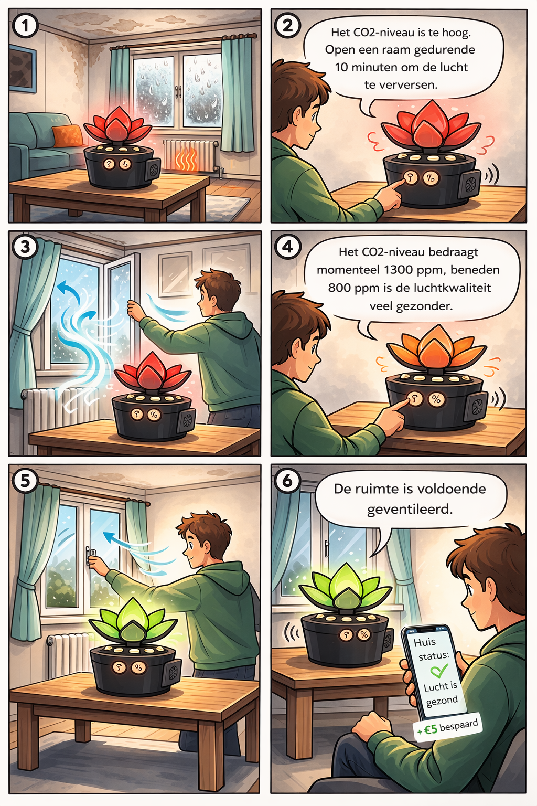
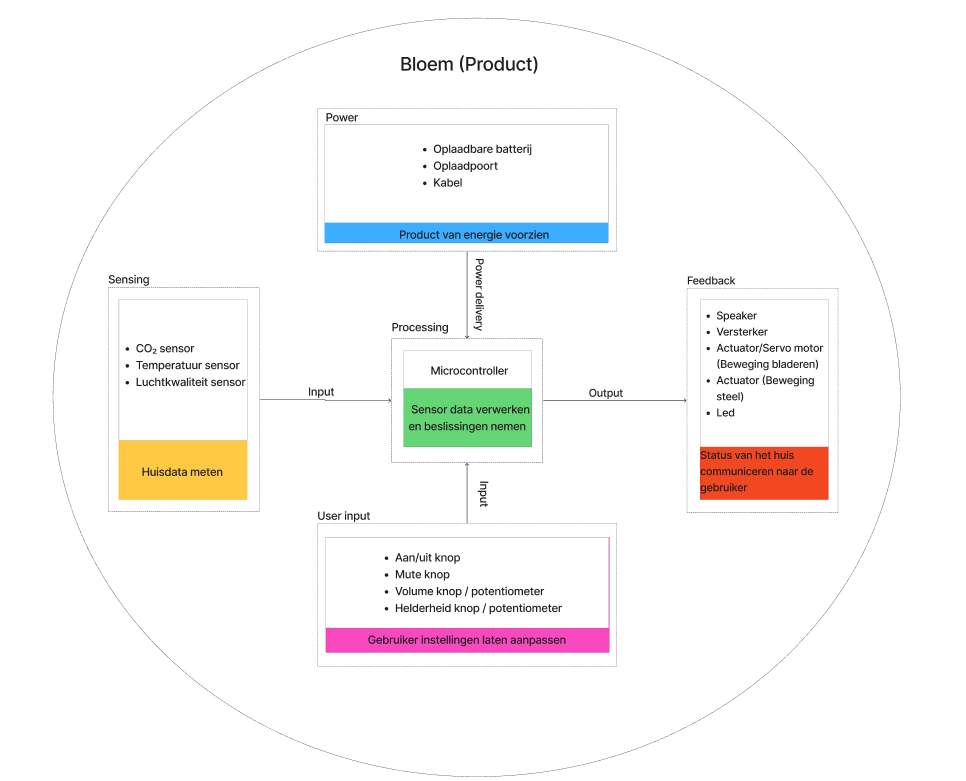

# Develop 1
## Onderzoeksvragen
- Kan ons product de status van je huis tonen doormiddel van voice feedback na aandacht trekken?
- Is de kost van de batterij en de zonnepanelen de moeite waard?
- Wordt de bloem primair gezien als gezondheidsmonitor
## Materiaal & methoden
Om de werking van het product en de interacties inzichtelijk te maken, werden verschillende analyse- en ontwerpbenaderingen toegepast. We begonnen met het opstellen van storyboards om typische gebruiksscenario’s te visualiseren en de interacties in kaart te brengen. Daarnaast is een morfologische kaart opgesteld om mogelijke variaties in functies, componenten en interacties systematisch te onderzoeken. Op basis hiervan zijn diverse structuren uitgewerkt die de logica en onderliggende redenering van het product verduidelijken.

Extra uitleg over onderstaande methoden is te vinden in de [Figma](https://www.figma.com/board/dso4iWV8H6f9n6ebzgw1lw/Les-2?node-id=0-1&p=f&t=9HAwHbptUp6RO2Ts-0).

### Storyboarding
  

  

### MVP-defenitie
Voor ons Minimum Viable Product (MVP) focussen we op de kernfunctionaliteiten die nodig zijn om het concept van de “Gezond Huis Bloem” te testen. Het prototype kan de luchtkwaliteit meten en deze informatie op een begrijpelijke manier communiceren naar de gebruiker. De bloem trekt de aandacht van de gebruiker en geeft visuele feedback via kleur en beweging van de bladeren. Op deze manier wordt de gebruiker bewust gemaakt van de luchtkwaliteit in huis en gestimuleerd om actie te ondernemen wanneer dit nodig is.

### Morfologische kaart
| Functie                                       | Variant 1                  | Variant 2                      | Variant 3                     | Variant 4                                | Variant 5          |
|-----------------------------------------------|----------------------------|--------------------------------|-------------------------------|------------------------------------------|--------------------|
| Meten van luchtkwaliteit                      | CO2 sensor                 | CO2 en luchtvochtigheid sensor | Multisensor(CO2, vocht, temp) | Modulaire sensor                         |                    |
| Hoofdfeedback(luchtkwaliteit zichtbaar maken) | Kleurverandering           | Openen/sluiten bloem           | Combinatie: kleur en beweging | Pushmelding in app                       | Haptische feedback |
| Activering                                    | Voice feedback             | Tekst in app                   | Tekst op scherm               |                                          |                    |
| Motivatie                                     | Wallet(besparing van geld) | Streak-systeem                 | Unlockbare kleuren            | Combinatie van wallet, streak en kleuren |                    |
| Energie voorziening                           | Kabel met stekker          | Interne batterij               | Zonnepanelen+ batterij        | Zonnepanelen + oplaadbare batterij       | Wegwerp batterijen |
| CO2 meting        | infrarood sensor           | chemische gassensor       | Multigas sensor               | Externe sensor unit                      |                    |
| Vocht meting      | Capacitatieve sensor       | Resistieve sensor         | Combinatie: kleur en beweging | Pushmelding in app                       | Haptische feedback |
| Temperatuurmeting | Digitale temperatuursensor | analoge temperatuursensor | infrarood topmeting           |                                          |                    |
| Motor             | Servo motor                | Stappen motor             | Unlockbare kleuren            | Combinatie van wallet, streak en kleuren |                    |
| Lichtfeedback     | RGB LED                    | LED ring                  | Zonnepanelen+ batterij        | Zonnepanelen + oplaadbare batterij       | Wegwerp batterijen |
| Gebruikers input  | Drukknoppen                | Draaiknop                 | Touch oppervlak               | App                                      |                    |
| Connectiviteit    | Bluetooth                  | Wifi                      |                               |                                          |                    |
### HTA

  

### Human Product Interaction

  

### Productarchitectuur

  

### User flow

  

### Brainstorming
Na de feedback op de tweede deelopdracht is besloten om de focus niet langer op kinderen te leggen. Onze job to be done is duidelijker geworden: het product richt zich nu op het behouden van een gezonde luchtkwaliteit. Hierdoor is ook de doelgroep gewijzigd. Voorheen richtten we ons op mensen zonder ventilatiesysteem die geld willen besparen; nu kan ook iemand met een ventilatiesysteem het product begrijpen en gebruiken.
Om dit te ondersteunen is de app-interface aangepast: de lay-out is grotendeels vernieuwd, de prioriteit ligt nu op gezonde luchtkwaliteit, en gebruikers kunnen hun ventilatie koppelen aan het product.
  

  
  
  
  

[app](https://www.figma.com/make/fhidNDvgxg0OYUNvX4qFZW/Interface-met-knoppen-en-kleuren?p=f&t=GiYPhHDJfWDRmSYa-0)

### Prototyping
In plaats van het eerste prototype verder aan te passen, werd ervoor gekozen om een nieuw prototype te maken. Het eerste prototype was vooral bedoeld om het basisidee te verkennen, maar bleek minder geschikt om terug gebruikstesten mee uit te voeren.
Met het nieuwe prototype konden deelnemers zich beter inbeelden hoe het uiteindelijke product zou functioneren in een echte situatie.
Daarnaast gaf dit nieuwe prototype ons ook de mogelijkheid om al verder na te denken over mogelijke functies, interacties en de manier waarop de feedback van het product aan de gebruiker wordt gecommuniceerd.

  
  
  
  

Er werd gestart met een standaard bloempot waarin een speaker werd geplaatst. De bladeren werden gelasercut en bevestigd aan een 3D-geprint scharnier. De bladen bewegen door het touwtje dat word samen getrokken. Daarnaast werden LED’s toegevoegd aan de binnenkant van de pot en aan de bovenste bladeren om extra visuele feedback te creëren.
### Gebruikerstesten(WOz)
Met het nieuwe prototype zijn testen uitgevoerd volgens de Wizard of Oz-methode, waarbij vijf respondenten hebben deelgenomen. Het doel was onderzoeken of voice feedback geschikt is om de status van een woning of de luchtkwaliteit weer te geven en op welke wijze deze het beste kan worden aangeboden. We hebben gekeken of voice feedback op zichzelf voldoende is, of dat het beter werkt in combinatie met een visuele interface. Daarnaast is een neutrale stem vergeleken met een meer persoonlijke stem.

Tijdens de test vroegen we gebruikers om de twee nieuwe knoppen te bedienen die de voice feedback activeren. De speaker werd vervolgens via een laptop aangestuurd met vooraf ingestelde zinnen. Na afloop onderzochten we via interviews hoe de gebruikers de feedback hebben ervaren.

Verder zijn verschillende voedingsmogelijkheden en de bijbehorende kosten (zoals batterijen en zonnepanelen) besproken om de voorkeur van de gebruiker te bepalen. Tot slot is de nieuwe 'Job to be Done' geëvalueerd om te bepalen of gebruikers de 'gezondheid' van het huis als belangrijkste doel zien, of dat zij meer waarde hechten aan energiebesparing en financiële voordelen.
[Interviewprotocol – Test Develop 1](https://docs.google.com/document/d/14uV6BEjJ6iHEM_Fh3N6zzjam72_YUCfdtqbi0Aa-V18/edit?tab=t.0)

  
  

### Resultaten

Uit de tests blijkt dat voice feedback geschikt is om de status van de woning te communiceren. Vier van de vijf testpersonen konden op basis van de boodschap een actie ondernemen, zoals verluchten. De feedback moet wel kort, duidelijk en eenvoudig zijn.

Alle testpersonen gaven de voorkeur aan korte en neutrale feedback. Een langere en meer persoonlijke stem werd minder positief ervaren omdat dit minder efficiënt aanvoelt en soms als “bepamperend”.

De meeste testpersonen vonden een scherm overbodig. Het kan esthetisch storend zijn en moeilijk leesbaar in zonlicht. Voice feedback gecombineerd met een app wordt als voldoende gezien.

Minder knoppen verhoogt gebruiksgemak.
Twee knoppen werden soms als verwarrend ervaren. Volgens de meeste testpersonen is één knop voldoende om informatie op te vragen. Extra informatie kan via de app worden gegeven.

Flexibele stroomvoorziening heeft de voorkeur.
Veel gebruikers verkiezen een oplaadbare batterij, eventueel met zonnepanelen. Dit maakt het product flexibeler en energiezuinig. Anderen verkiezen een stekker vanwege de betrouwbaarheid. Gebruiksgemak en flexibiliteit blijken belangrijker dan de laagste kostprijs. En omdat je zonnepanelen niet overal in huis even goed werken wordt de flexibiliteit weer minder dus zal gekozen worden voor enkel een oplaadbare batterij.

Testpersonen gaven aan dat gezondheid belangrijker is dan financiële besparing. Het product wordt dus vooral gezien als een gezondheidsmonitor voor de woning, waarbij energiebesparing een bijkomend voordeel is.

Suggesties uit de tests zijn onder andere lichtsignalen voor extra aandacht, meldingen bij een lege batterij en speelse interacties zoals water geven aan de bloem.
[Analyse Test Develop 1](https://docs.google.com/document/d/18PjJ0K22VwaZccacPXWkhhGwo1DeL2UdXLAWv1GZMLM/edit?tab=t.0)

### Conclusies
De onderzoeken en tests tonen aan dat het product zijn doel kan vervullen als gezondheidsmonitor voor de woning. Voice feedback blijkt een effectieve manier om gebruikers te informeren over de status van hun huis en de luchtkwaliteit. Korte, neutrale boodschappen werken het best, terwijl een scherm niet noodzakelijk is.

Gebruikers geven de voorkeur aan een eenvoudige bediening met één knop en een flexibele stroomvoorziening, zoals een oplaadbare batterij. De nadruk ligt duidelijk op het behouden van een gezonde leefomgeving, terwijl energiebesparing een secundair voordeel vormt.

Daarnaast geven de testresultaten waardevolle inzichten voor verdere ontwikkeling: lichte visuele signalen, meldingen bij een lege batterij. Het prototype en de methoden (storyboards, morfologische kaart, Wizard of Oz-testen) hebben geholpen om de logica van het product te begrijpen en de ontwerpbeslissingen te onderbouwen.
