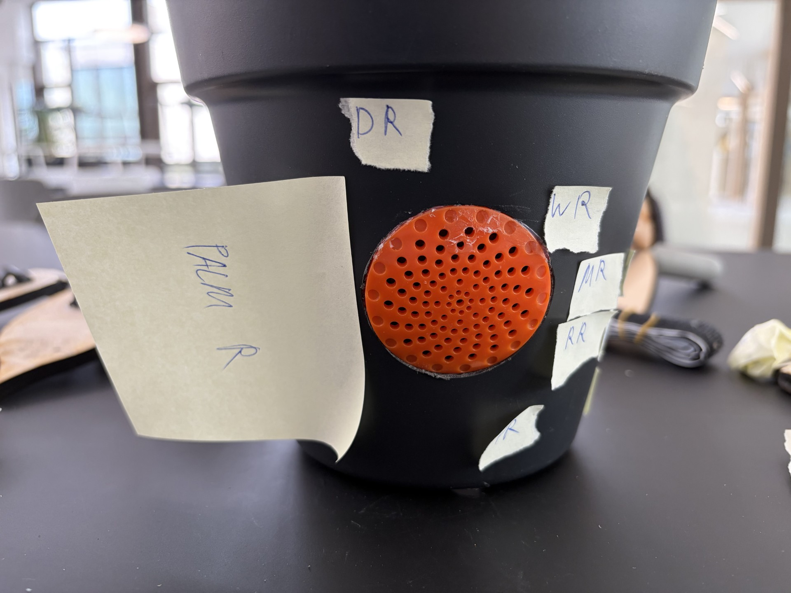
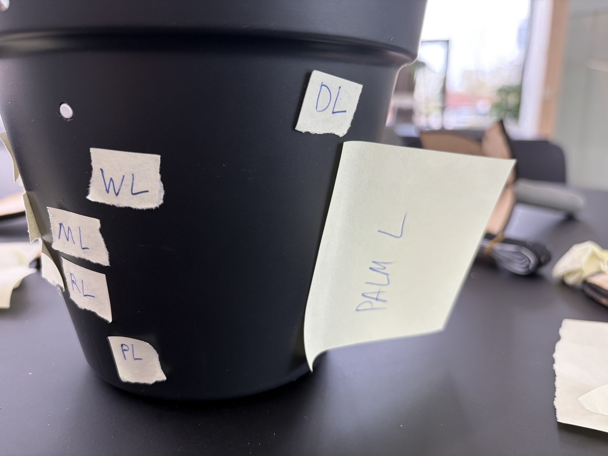
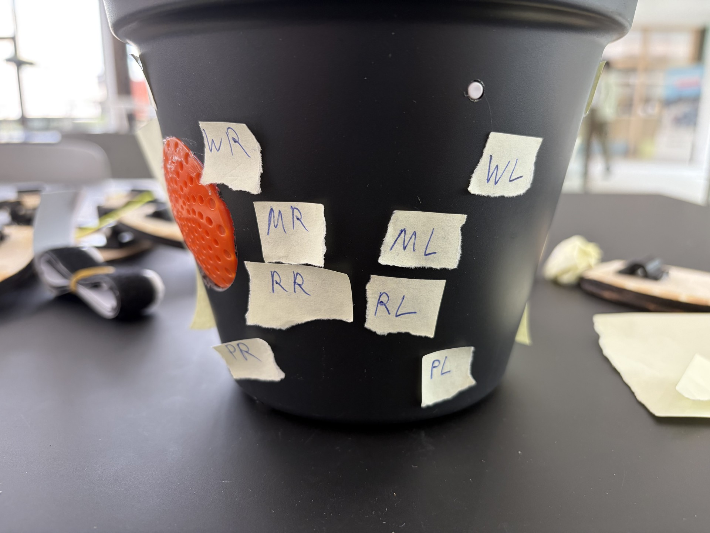
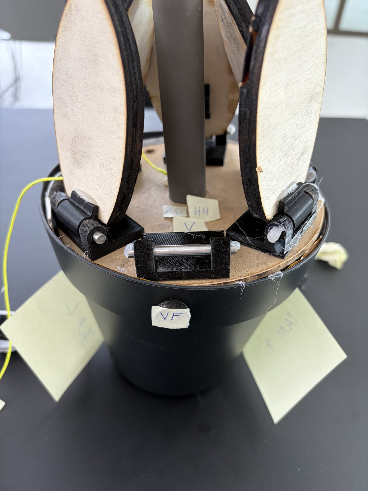

# Develop 2
## Doelstellingen
In deze deelopdracht analyseren we hoe het product zich verhoudt tot de menselijke afmetingen en de gebruikerservaring. Dit doen we voor de bedieningsknoppen en pot waar de bloem in gaat. Door tests wordt bepaald:
- Welke positie van knoppen het meest gebruiksvriendelijk is 
- Wordt voorkeur gegeven aan druk of draaiknoppen
- Welke soort drukknoppen krijgt de voorkeur 
- Kan een luchtbevochtiger een eventuele frustratie van de gebruiker kan verhelpen

Ook zijn er usability goals opgesteld:
- Gebruikers kunnen de interface van het product zonder enige moeite bedienen.
- Gebruikers kunnen de handelingen die bij het gebruik van de bloempot komen uitvoeren zonder frustraties.
- Een nieuwe gebruiker kan binnen 2 minuten de belangrijkste functies (zoals het instellen van een watergeefschema) begrijpen en configureren zonder de handleiding te raadplegen."

## Antropometrische Analyse
De afmetingen van het product werden bepaald op basis van antropometrische gegevens en volgen zowel design for the small als design for the mean. De bloempot werd compacter gemaakt zodat ook gebruikers met kleinere handen deze comfortabel met twee handen kunnen vastnemen. De rand werd geoptimaliseerd voor een precision grip (duim en wijsvinger), wat zorgt voor betere controle en comfort. De knoppen zijn afgestemd op de gemiddelde vingerdikte, waardoor ze nauwkeurig en zonder fouten bediend kunnen worden. Deze combinatie resulteert in een ergonomisch en gebruiksvriendelijk ontwerp voor een brede doelgroep. De volledige analyse is te vinden in [antropometrische analyse](https://docs.google.com/document/d/1EPGG9i6jSZKGZ7VrqN3QsUSug69F0fZezZaDpOkvLG0/edit?tab=t.0). Alle afmetingen zijn gevonden op [dinbelg](https://www.dinbelg.be/volwassenentotaal.htm).

Hieronder zijn ook nog enkele afbeeldingen van de touch points te vinden.
  

  
  
  
  

## Enquête
Door een enquête uit te voeren kon duidelijke inzichten in de voorkeuren van gebruikers op vlak van esthetiek en functionaliteit van een bloempot verkregen worden. De enquete werd opgesteld door een trendanalyse die eerst werd uitgevoerd met neutrale opties erbij.
 [Onderzoeksrapport: Esthetische Trendanalyse 2025-2026](https://docs.google.com/document/d/1XbN4_xj7GFptLyKK2W8NfHi_5yDkYqNKcF5txezoNHw/edit?tab=t.0#heading=h.ga6rusatmwly)

  

  

Op vlak van kleurgebruik scoren neutrale en zachte tinten het best. Kleuren zoals soft sandstone en marmerwit worden als veelzijdig ervaren en passen in verschillende interieurs. Dit wordt versterkt door het feit dat een meerderheid van de respondenten het belangrijk vindt dat de bloempot visueel aansluit bij hun bestaande inrichting.

  

  

Wat betreft vorm en textuur blijkt dat simpele geometrische vormen, zoals cilindrische, conische bloempotten en vaas vormige bloempotten het meest aanspreken. Daarnaast is er een duidelijke voorkeur voor matte afwerkingen en subtiele texturen, zoals ribbelstructuren.

  

  

De bloempot wordt voornamelijk gezien als een functioneel en subtiel object, eerder dan een eyecatcher. De meeste respondenten geven de voorkeur aan een formaat dat geschikt is voor middelgrote planten en dat eenvoudig geplaatst kan worden op een kast, tafel of vensterbank.

  

  

Tot slot blijkt dat er interesse is in het concept, maar dat eenvoud en gebruiksgemak centraal blijven staan. Gebruikers verkiezen een afgewerkt product boven een modulair systeem en zijn bereid een nieuwe bloempot aan te schaffen wanneer ze verandering willen.

Uit deze resulaten worden 3 concepten gevormd waaruit gebruikers kunnen kiezen tijdens de aankoop.

- Bloempot 1: Landelijk (Rustiek)
  Vorm: Een organische vaasvorm met een brede buik en een tuit.
  Kleur: Soft Sandstone
  Textuur: Mat zandsteen met onregelmatige, handgevormde horizontale ribbels.
  Beschrijving: Een perfecte match voor een landelijk interieur, warm en natuurlijk.

- Bloempot 2: Scandinavisch (Minimalistisch)
  Vorm: Een strakke, minimalistische cilinder, geïnspireerd op de pot die je mooi vond in je referentiefoto.
  Kleur: Zwart ( zwart werd niet vaak gekozen maar het is een alternatief die als kleur  in hedendaagse producten veel voorkomt)
  Textuur: Mat zwart met strakke, symmetrische verticale ribbels.
  Beschrijving: Een tijdloos en functioneel ontwerp, typerend voor de Scandinavische stijl.

- Bloempot 3: Modern (Luxueus)
  Vorm: Een strakke V-vorm die naar beneden toe smaller wordt.
  Kleur: Marmer wit
  Textuur: Glanzend marmerwit met een subtiele, gladde marmertekening en een hoge glans.
  Beschrijving: Een modern en strak statement-stuk, dat zorgt voor een luxe uitstraling.
  Hieronder is een render te zien van de 3 concepten.

  

  

De volledige analyse van de enquête is te vinden in [analyse enquête](https://docs.google.com/document/d/19_CdSDRdH0FaFUVYFXiZnsAKY0Y2GnrCZgDpmhAUXtg/edit?tab=t.0).
## Gebruikerstesten
We hebben gebruikerstests (met 6 respondenten) gedaan om de gebruiksvriendelijkheid te verbeteren. Hierbij stonden het type knoppen en hun positie centraal. Ook hebben we de nieuwe luchtbevochtiger-functie bevraagd. Het idee hiervoor ontstond tijdens het programmeren van de Arduino en het bouwen van de hardware, toen we merkten dat de luchtvochtigheid vaak te laag was. Omdat de meeste mensen geen luchtbevochtiger in huis hebben, stelden we voor om deze in de pot te verwerken.
### Doel
Het doel van deze test is het evalueren en bepalen van:
- Welke positie van knoppen het meest gebruiksvriendelijk is 
- Voorkeur druk of draaiknoppen
- Welke soort drukknoppen de voorkeur krijgt
- Of een luchtbevochtiger een eventuele frustratie van de gebruiker kan verhelpen
### Prototype
Tijdens vorige testen in develop 1 werd vastgesteld dat het prototype die toen gebruikt werd voor sommigen verwarring veroorzaakte omdat alles handmatig moest en omdat de voicefeedback met de laptop werd aangestuurd.
Daarom werd een nieuw prototype gemaakt waarbij alles geautomatiseerd werd. Meer info kan je vinden in [Prototype Develop 2](https://docs.google.com/document/d/1KZKG2nf8R3pGhrNtYaQHk-xGyXQ1loalpgCZGoeq-t4/edit?tab=t.0) .

Op de afbeelding hieronder kan je het prototype zien die gebruikt werd met daarop klittenband zodat de knoppen makkelijk erop en af konden.

  

  

Om confirmation bias te vermijden, hebben we gebruikgemaakt van variety prototyping. Door de knoppen met klittenband op verschillende posities aan te bieden, konden we objectief meten welke lay-out de kortste zoektijd en minste fouten opleverde, in plaats van slechts één vooraf bepaald concept te valideren. Ook werden verschillende drukknoppen voorgesteld.die je kan zien in het protocol.
### Testen

Tijdens de tests hebben we het Think Aloud Protocol toegepast. Hierdoor kregen we niet alleen inzicht in wat de gebruiker deed, maar ook in de frustraties of onduidelijkheden die zij ervoeren bij het eerste gebruik.

### Conclusies

Uit de gebruikerstesten blijkt dat:
- Draaiknoppen de beste keuze zijn voor instelbare functies
- Ingewerkte knoppen het meest aansluiten bij het gewenste design
- De positie van knoppen een evenwicht moet zijn tussen esthetiek en gebruiksgemak

| Knop                                       | Positie                  | Reden                      
|-----------------------------------------------|----------------------------|--------------------------------|
| Aan/uit                      | Zijkant van de pot, licht naar de achterzijde gericht            | Makkelijk bereikbaar maar niet zichtbaar van voren | 
| Voice feedback | Zijkant van de pot, voorkant           | Vaak gebruikt → centraal en zichtbaar    
| Draaiknop (geluid)                      | In de pot (zijkant, half verborgen)            | Minder gebruikt, esthetisch wegwerken | 
| Draaiknop (licht) | In de pot (andere zijde)          | Minder gebruikt, esthetisch wegwerken   

Afbeeldingen met de knoppen op de juiste plaats kan je hieronder zien.

  

  
  

- De luchtbevochtiger een duidelijke meerwaarde biedt en inspeelt op een reëel probleem
  Uit de testen in develop 1 gaven sommige gebruikers aan dat water geven aan de plant wel een toffe toevoeging zou zijn.
  Omdat de luchtbevochtiger water verbruikt uit het reservoir, wordt het bijvullen een logisch onderdeel van de interactie met de plant. Dus dit is een extra pluspunt omtrent user experience.
  
Meer info zie [Analyse test develop 2](https://docs.google.com/document/d/1LS81rWTh8fn5G55BaOMGvlZr1KS65SzYiV8W_BzbE0Y/edit?tab=t.0) .

