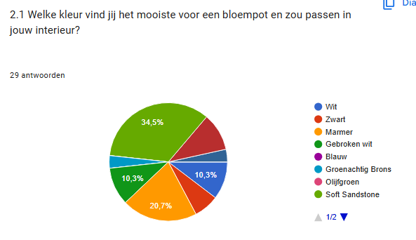
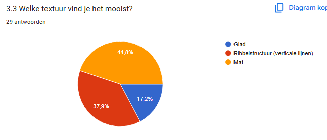
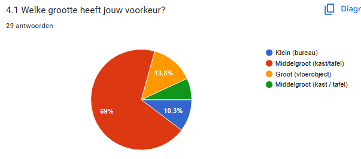
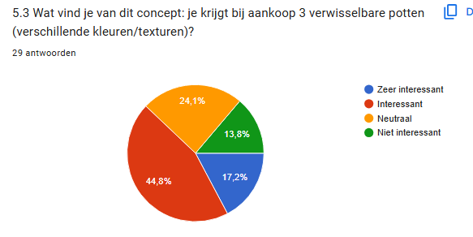

# Develop 2
## Antropometrische Analyse
De afmetingen van het product werden bepaald op basis van antropometrische gegevens (DINED) en volgen zowel design for the small als design for the mean. De bloempot werd compacter gemaakt zodat ook gebruikers met kleinere handen deze comfortabel met twee handen kunnen vastnemen. De rand werd geoptimaliseerd voor een precision grip (duim en wijsvinger), wat zorgt voor betere controle en comfort. De knoppen zijn afgestemd op de gemiddelde vingerdikte, waardoor ze nauwkeurig en zonder fouten bediend kunnen worden. Deze combinatie resulteert in een ergonomisch en gebruiksvriendelijk ontwerp voor een brede doelgroep. De volledige analyse is te vinden in [antropometrische analyse](https://docs.google.com/document/d/1EPGG9i6jSZKGZ7VrqN3QsUSug69F0fZezZaDpOkvLG0/edit?tab=t.0).
Hieronder zijn ook nog enkele afbeeldingen van de touch points te vinden.
## Enquête
De enquête biedt duidelijke inzichten in de voorkeuren van gebruikers op vlak van esthetiek en functionaliteit van een bloempot. In het algemeen blijkt dat er een sterke voorkeur is voor eenvoudige, strakke en moderne ontwerpen. Hoewel ook organische vormen enige interesse opwekken, blijven minimalistische designs duidelijk dominant.

  

  

Op vlak van kleurgebruik scoren neutrale en zachte tinten het best. Kleuren zoals soft sandstone, wit en zwart worden als veelzijdig ervaren en passen in verschillende interieurs. Dit wordt versterkt door het feit dat een meerderheid van de respondenten het belangrijk vindt dat de bloempot visueel aansluit bij hun bestaande inrichting.

  

  

Wat betreft vorm en textuur blijkt dat simpele geometrische vormen, zoals cilindrische en conische bloempotten, het meest aanspreken. Daarnaast is er een duidelijke voorkeur voor matte afwerkingen en subtiele texturen, zoals ribbelstructuren. Dit toont aan dat gebruikers detail waarderen, zolang het niet te opvallend of storend is.

  

  

De bloempot wordt voornamelijk gezien als een functioneel en subtiel object, eerder dan een eyecatcher. De meeste respondenten geven de voorkeur aan een formaat dat geschikt is voor kleinere planten en dat eenvoudig geplaatst kan worden op een kast, tafel of vensterbank.

  

  

Tot slot blijkt dat er interesse is in het concept, maar dat eenvoud en gebruiksgemak centraal blijven staan. Gebruikers verkiezen een afgewerkt product boven een modulair systeem en zijn bereid een nieuwe bloempot aan te schaffen wanneer ze verandering willen.

Samengevat moet het ontwerp inzetten op minimalisme, neutrale kleuren, gebruiksvriendelijkheid en integratie in het interieur om optimaal aan te sluiten bij de verwachtingen van de gebruiker.

De volledige analyse van de enquête is te vinden in [analyse enquête](https://docs.google.com/document/d/19_CdSDRdH0FaFUVYFXiZnsAKY0Y2GnrCZgDpmhAUXtg/edit?tab=t.0).
