# Develop 3
## Doelstellingen
In deze deelopdracht onderzoeken we twee aspecten van het product: het waterreservoir en de CMF (Color, Material, Finish) van de verschillende onderdelen. Door tests wordt bepaald:

- Wat de beste manier is om het waterreservoir te vullen en te implementeren
- Welke CMF-keuzes de voorkeur krijgen voor de steel, de bladeren, de bodemplaat, de ventilatie en het licht

## Prototype

  

  

In het prototype werd onze eigen voorkeur voor het waterreservoir geïmplementeerd: een reservoir dat via een draaibeweging kan worden losgekoppeld, met een plug om het bij te vullen. Het reservoir wordt extra vastgehouden met magneten.
  

  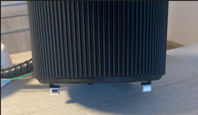
  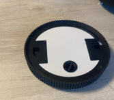
  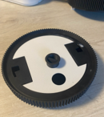

Daarnaast is het prototype voorzien van elektronica en code, zodat de functies (zoals de verlichting) ook effectief werken. Hierdoor krijgen testpersonen een realistischer en duidelijker beeld van het uiteindelijke product, in plaats van enkel een statische maquette. De code voor de werking is te vinden src. Alle onderdelen voor het maken van dit prototype wat ook het finaal prototype is is te vinden in de Bill Of Materials. Ook is er in de Bill Of Materials een versimpeld connectieschema te vinden.

Voor de CMF werden via Vizcom verschillende visualisaties gegenereerd, zodat de verschillende onderdelen (bladeren, steel, ventilatie, licht en bodemplaat) in diverse kleuren, materialen en finishes konden worden voorgelegd aan testpersonen.
## Testen
Voor het waterreservoir hebben we het Think Aloud Protocol toegepast: testpersonen voerden de handelingen uit om het reservoir te openen en te vullen (zonder water), waarbij we observeerden of er knelpunten waren. Daarna werd gepeild naar plus- en minpunten, en werd ook een alternatief ontwerp (een vulopening aan de zijkant) voorgelegd.

Voor de CMF werden de testpersonen de verschillende mogelijkheden per onderdeel voorgelegd. Per onderdeel werd gevraagd naar de drie meest favoriete opties (gerangschikt) en de minst favoriete optie, telkens met motivatie.
In totaal namen 4 testpersonen deel (2 vrouwen, 2 mannen, leeftijden tussen 25 en 76 jaar), wat een brede spreiding in leeftijd en perspectief opleverde. Het volledige protocol is te vinden in [protocol develop 3](https://docs.google.com/document/d/1AFxn7SNG4gidYgDGYXC2rl6uFhPbX5SC4VyNPNwO1w4/edit?tab=t.0).
## Conclusies
### Waterreservoir

Het gebruiksgemak van het reservoir (openen, vullen, sluiten) wordt over het algemeen als intuïtief en eenvoudig ervaren. Het draaimechanisme en de visuele passing van de onderdelen scoren goed. Toch kwamen enkele knelpunten naar voren:

De vuldop wordt door bijna alle testers als te klein ervaren, wat de grip bemoeilijkt
Er ontbreekt duidelijke feedback (zoals een hoorbare of voelbare klik) bij het sluiten, waardoor gebruikers twijfelen of het reservoir goed vergrendeld is
De reinigbaarheid van het reservoir wordt als aandachtspunt genoemd

Het alternatieve ontwerp (vulopening aan de zijkant) werd grotendeels afgewezen om esthetische redenen: een opening die groot genoeg is voor een gieter zou afbreuk doen aan het strakke design.

### CMF-voorkeuren
| Onderdeel | Voorkeur | Reden |
|------------|------------|------------|
| Bladeren (vorm) | Realistische, plant-achtige vormen (opties 2, 4, 6) | Natuurlijke uitstraling, herkenbaar als kamerplant |
| Bladeren (kleur/textuur) | Lichte, frisse tinten met zichtbare nerven (optie 6) | Contrast met zwarte pot, duurzame uitstraling |
| Steel | Compacte steel met bloemdetail (opties 5 en 8) | Harmonieuze kleuren, bloeiend/interactief effect gewaardeerd |
| Ventilatie | Optie 2 | Volgt de ribbel-lijnen van de pot, esthetisch én makkelijker schoon te maken |
| Licht | Subtiele, geïntegreerde verlichting in blad of steel (opties 10/11) | Minimalistisch, externe lichtpunten worden als "kerstboomachtig" ervaren |
| Bodemplaat | Optie 3 (steentjes/kiezels) | Natuurlijke, authentieke uitstraling |

### Bladeren (vorm)
  

  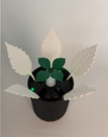
  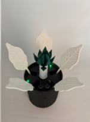
  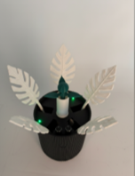

### Bladeren (textuur)
  

  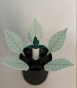

### Steel
  

  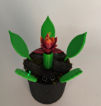
  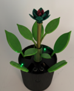

### Ventilatie
  

  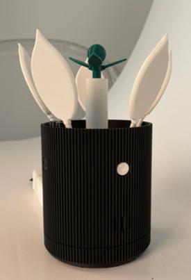

### Licht
  

  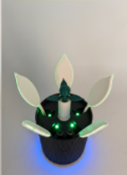
  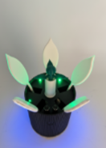

### Bodemplaat
  

  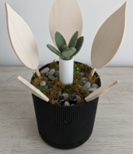

### App
Tijdens het testen van de verschillende mogelijkheden voor het signaallicht bleek vooral dat het rustig en subtiel moest blijven. Daarom is er teruggegrepen naar een eerdere ontwerpvereiste voor de [App](https://last-name-51594304.figma.site). Namelijk de app had de mogelijkheid om een kleur te kunnen ontgrendelen door goed te ventileren en die kleur was bedoeld als extra licht aan de onderkant van de pot. Nu met dat licht zal je wel je bloem kunnen personaliseren maar het kant te druk zijn 2 verschillende kleuren licht en het signaal licht zal minder duidelijk zijn. Ook zal het meer kosten en bijvoorbeeld oudere mensen die niet met en gsm kunnen werken kunnen het niet gebruiken.

In plaats daarvan hebben we een systeem toegevoegd dat je je punten kan delen met vriende, familie, over heel de wereld, ... . Met mensen die ook een OXYBloom hebben. Zo is er ook motivatie. Dit zal wel nog moeten getest worden.

## Feedback en aanbevelingen vanuit gesprek met studenten (Gent)
Tijdens een gesprek in Gent met enkele andere studenten over ons project, kwamen enkele waardevolle inzichten en suggesties naar voren voor de verdere ontwikkeling van het concept:

Interactie en toegankelijkheid
- Het interactieve gedeelte van het product wordt gezien als een sterk verkoopsargument
- Trilfunctie in de bijhorende app zou een meerwaarde kunnen zijn voor gebruikers met een visuele beperking

Modulariteit en duurzaamheid
- Vervangbare onderdelen zouden de levensduur en duurzaamheid van het product verhogen
- In combinatie met een CO2-filter zou de plant (en bijhorende functies) volledig zelfstandig kunnen functioneren

Sensoren en externe uitbreiding
- Een extern apparaat (buiten geplaatst) met aanvullende sensoren zou meer relevante informatie over de luchtkwaliteit kunnen verzamelen
- De diffuser zou ook gebruikt kunnen worden om geuren te verspreiden, bijvoorbeeld tijdens het koken

Gebruikerservaring
- Een trager/subtieler reagerend apparaat (minder onmiddellijke feedback) wordt als positief ervaren
- In de app zou de CO2-waarde visueel weergegeven kunnen worden via een balkje (indicatie van goed/slecht), in plaats van enkel een numerieke  waarde

Business model
- Prijsbepaling wordt als een cruciaal aspect beschouwd
- Een Pro-versie met extra functies kan voor niet-betalende gebruikers als een gemis overkomen, omdat ze zien welke functies ze missen — dit verdient verdere overweging

## Eindoordeel
De testresultaten tonen aan dat gebruikers een balans zoeken tussen technologie en natuur. De grootste winstpunten liggen in realistische detaillering van de plant (nerven, steentjes, natuurlijke vormen) gecombineerd met subtiele technologische integratie (minimalistisch licht).
Aanbevolen definitieve keuzes

- Reservoir: grotere vuldop, voelbare klik bij sluiten, verbeterde reinigbaarheid
- Bladeren: organische vorm met subtiele nerven, lichte matte groentinten, zachte textuur
- Steel: compacte, natuurlijke vorm met bloeiend/interactief effect en harmonieuze kleurverdeling
- Ventilatie: optie 2, geïntegreerd en minimalistisch
- Licht: subtiele verlichting in blad of steel, warm en indirect, geen opvallende externe lichtpunten
- Bodemplaat: optie 3 met steentjes/kiezels, matte natuurlijke afwerking

Meer info zie [Analyse Develop 3](https://docs.google.com/document/d/1FLf_whq74Fe5Exia7DLtALLMpERrBxRFpvECkAxbEaY/edit?tab=t.0).
