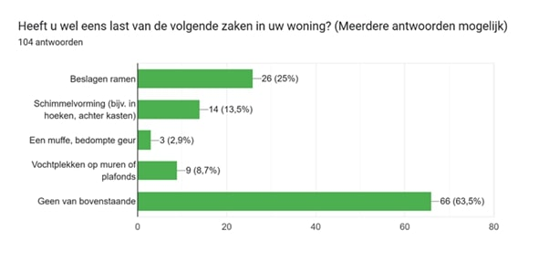

## Discovery
Max. 1000 woorden.   
[!] Algmeen: Maak voldoende gebruik van schematische/grafische weergaves en tabellen.
### Doestellingen
Wat wilde je bereiken?   
Welke deelvragen moesten hiervoor beantwoord worden?
### Materiaal & methoden
Hoe onderzocht je dit? Wees volledig.    
Leg uit welke onderzoeksmethoden werden uitgevoerd en hoe dit werd aangepakt (link door naar het protocol).
### Resultaten
Rapporteer over de resultaten (incl. foto's, quotes, analyseframeworks, ...)
### Conclusies & implicaties
Definieer de belangrijkste designbeslissingen

# Discovery
## Doelstellingen

- Inzicht krijgen in de relatie tussen energieverbruik, ventilatiegedrag en vochtproblematiek.
- Begrijpen hoe mensen vandaag omgaan met luchtkwaliteit en duurzaamheid in huis.
- Achterhalen welke drempels (kennis, gedrag, prijs, complexiteit) duurzaam ventileren in de weg staan.
- Bestaande oplossingen analyseren en gaten in de markt blootleggen.
- Verworven informatie gaan combineren tot een eerste concept.

## Materiaal & methoden

### Literatuuronderzoek

### Interviews

### Benchmarking

### Enquête
De enquëte is gelanceerd om een duidelijk beeld te krijgen van hoe mensen omgaan met ventilatie en energieverbruik. De vragen bespraken vooral hoe mensen staan tenopzichte van het ventileren en of zij de link tussen energie en ventileren konden leggen.
Ik heb deze enquête gelanceerd om een duidelijk beeld te krijgen van hoe mensen omgaan met ventilatie en energieverbruik in huis. De resultaten zijn veelzeggend: 76,9% van de deelnemers maakt zich zorgen over de hoogte van de energierekening. Toch blijkt dat bijna de helft – 48,1% – niet wist dat kort en krachtig luchten energiezuiniger is dan constant ventileren of helemaal niet luchten.
Uit een andere grafiek blijkt dat 36,5% van de respondenten kampt met vochtproblemen, zoals schimmel of beslagen ramen. Dit bevestigt dat er een duidelijke kloof is tussen kennis en gedrag. Maar er is ook goed nieuws: maar liefst 80% staat open voor een eenvoudige tool die aangeeft wanneer het ideale moment is om te luchten.
Met deze inzichten kunnen we een slimme, toegankelijke oplossing ontwikkelen die niet alleen het binnenklimaat verbetert, maar ook zorgt voor een lagere energierekening.

## Resultaten
### Enquête
Uit de enquête kwamen enkele opvallende resultaten, de drie belangrijkste worden hieronder kort besproken.
#### 1. Welke problemen ondervinden mensen in hun huis?

  

Opvallend is dat 36,5% van de respondenten aangeeft last te hebben van minstens één vochtprobleem. Het meest voorkomende probleem zijn beslagen ramen, dat door 25% van de deelnemers wordt ervaren. Schimmel komt voor bij 13,5% van de respondenten, wat een serieus gezondheidsrisico vormt. Daarentegen wordt de muffe geur nauwelijks gerapporteerd, slechts door 2,9% van de ondervraagden.

#### 2. Zijn mensen op de hoogte van het feit dat een vochtig huis meer energie kost om te verwarmen?

  

Bijna de helft van de mensen is zich er niet van bewust dat goed ventileren juist energie bespaart in plaats van kost. Dit laat zien dat er een grote kennis- en gedragskloof bestaat rond duurzaam ventilatiegedrag.

#### 3. Zouden mensen een eenvoudig apparaatje kopen om hun te helpen?

  

Een ruime meerderheid van 79,8% staat open voor de oplossing, en meer dan een kwart (28,8%) zou het zeker gebruiken. Tegelijkertijd geeft 51% aan dat betaalbaarheid een belangrijke factor is. Slechts 20,2% van de respondenten zou het waarschijnlijk of zeker niet gebruiken.

